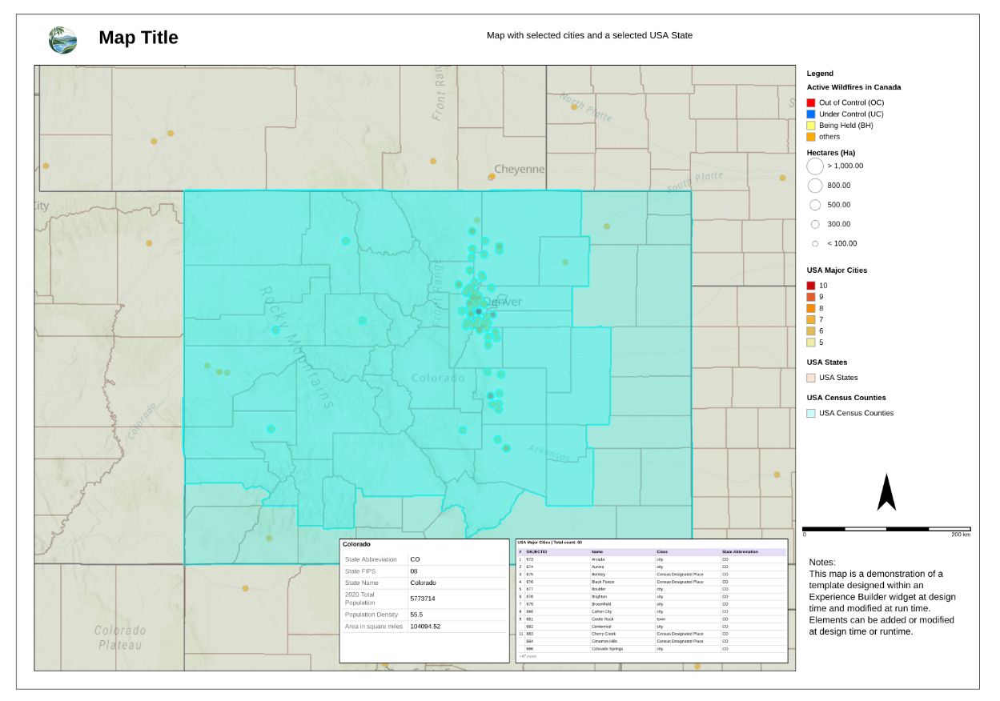
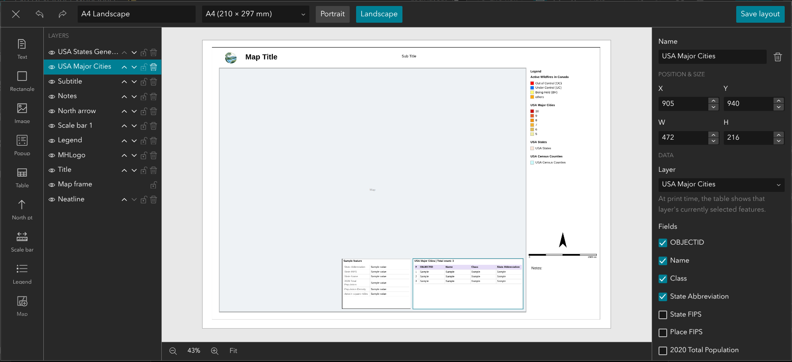

# Print Studio

A custom [ArcGIS Experience Builder](https://developers.arcgis.com/experience-builder/) widget that lets app designers build print/export layout templates — title, logo, legend, scale bar, north arrow, attribute table, feature popup card, and more, arranged with a drag-and-drop editor — and lets app viewers export the connected map as a vector PDF or a high-resolution JPEG or PNG image, right from the running app.

> Print Studio grew out of `print-export-widget` (now archived), adding vector PDF export, true-scale printing, GeoPDF output and viewer-created templates. The design decisions are recorded in `print-studio-spec.md`.

**[Try the live demo](https://mhoyland.github.io/widget-experience/)** · **[User guide](docs/user-guide.md)** ([web version](https://mhoyland.github.io/widget-experience/help/))



## Features

- **Drag-and-drop layout editor** — position, resize, style, and layer text, images, shapes, a north arrow, a scale bar, a legend, an attribute table, and a feature popup card on a page-sized canvas, with snap/align guides, undo/redo, and live preview against the connected map.
- **Reusable templates** — designers curate a set of templates in the widget's Setting panel; app viewers pick one at runtime. Templates can be saved to/loaded from ArcGIS Online/Portal, or exported to and imported from a local `.json` file.
- **High-resolution export** — exports a ~300dpi PNG, cropped to an aspect-correct, adjustable "print area" box on the map (with a "Show print area" preview, same behavior as the built-in Print widget).
- **Export and Preview** — choose the **File format** (`jpg`, `pdf` — the default — or `png`, listed like the built-in Print widget's) and click **Export** to download the file. **Preview** opens the page in a new tab to check it first; the tab only shows the page and a Close button, so there is one place to export from.
- **Viewer-created templates** (optional) — with "Allow viewers to create templates" on, viewers get **New template** and **Duplicate** in the template list. A new template starts with an unlocked map frame; the viewer's own templates are fully editable by them (including page size and orientation), kept in their browser, and can be saved to a file. Templates kept only in the browser are tagged *Not saved to file* or *Unsaved changes* until they're saved to file, with a reminder in the panel.
- **Optional runtime customization** — designers can allow viewers to nudge/restyle elements, and even add their own new elements, before exporting — without ever touching the designer's own saved template. Viewer-imported templates persist across a page refresh via `localStorage`.
- Full attribute-table and popup-card rendering pulls live data from the connected map's selected features.
- **Print scale** — in the widget's **Advanced** section, viewers choose Current map extent (the default), Current map scale, or Set map scale, like the built-in Print widget. Scales are true scale at the centre of the map, so they can be measured with a ruler even on Web Mercator basemaps; the print area on the map shows exactly what will print at the chosen scale.
- **GeoPDF** — exported PDFs are georeferenced by default (ISO 32000-2 geospatial PDF), so Avenza Maps can show your location on the map and Acrobat, ArcGIS Pro, QGIS and GDAL can read coordinates from it or place it on the ground. Rotated maps and projected coordinate systems (for example NZTM) are supported. It can be turned off in the widget's Advanced section.
- **Accurate scale bar** — measured from the map area actually printed (geodesic distance), not from the screen.
- **Vector PDF export** — with Format set to PDF, Export saves the page as a PDF with real, searchable text and sharp vector graphics (legend, scale bar, north arrow, tables, shapes); only the map and images are raster. The map image resolution is chosen in Advanced (150, 200 or 300 dpi; 200 by default). Text uses the PDF standard fonts (Arial → Helvetica, Times New Roman → Times, Courier New → Courier). Text containing characters outside the Western European set (for example macrons) is drawn as a high-resolution image, so it prints correctly but is not selectable.



*The layout editor: add elements from the tool rail, arrange them in the Layers list, and style the selected element in the properties panel.*

## Requirements

- ArcGIS Experience Builder **Developer Edition**, version 1.21 (matches this widget's `manifest.json` `exbVersion`).
- This widget uses `interactjs` for drag/resize, which ships as a dependency of the Experience Builder Developer Edition SDK itself (`client/package.json`) — not something this widget's own folder declares. If your checkout doesn't already have it, run `npm install interactjs @interactjs/types` from your `client/` root.

## Installation

1. Copy this folder into your Experience Builder Developer Edition checkout, at:
   ```
   client/your-extensions/widgets/print-studio/
   ```
2. Run `npm install` from `client/`. This widget has its own `package.json` and `pnpm-lock.yaml` (for [jsPDF](https://github.com/parallax/jsPDF), MIT), which the client's install step installs automatically.
3. Restart the client dev server (`npm start` from `client/`) so it picks up the new widget.
4. In the Experience Builder app designer, add the "Print Studio" widget from the widget panel and connect it to a Map widget.

## Configuration

In the widget's Setting panel:

- **Map widget** — pick which Map widget this widget controls.
- **Templates** — add, duplicate, edit, import (from a local `.json` file), or save/load templates to/from Portal.
- **Options** — allow app viewers to adjust the layout before exporting, and optionally add their own new elements.

## Notes

- The user guide lives in `docs/user-guide.md`, with screenshots in `docs/images/`. `node docs/build-help-page.mjs <folder>` (run inside the Experience Builder client) turns it into the web page published with the demo site.

- `print-studio-spec.md` is the original phase-by-phase build spec this widget was developed against — kept for anyone curious about the design decisions behind it.
- This widget has no automated test suite; verification during development was done via `tsc`/`eslint` plus manual testing in a running Experience.
