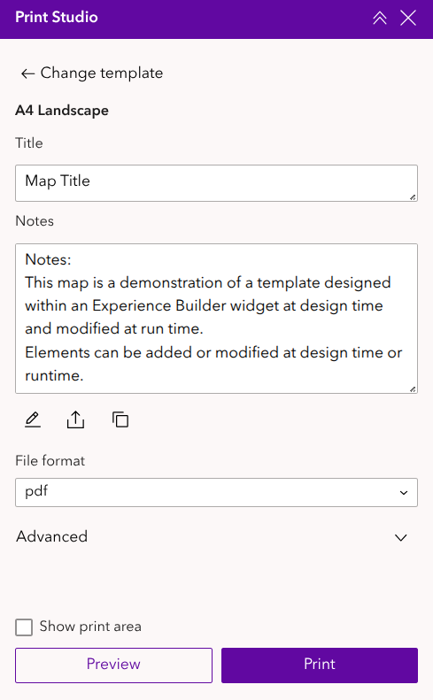
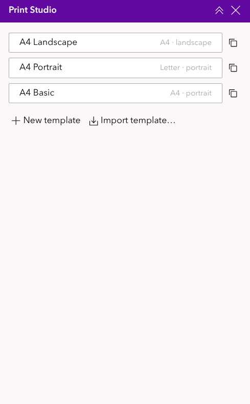
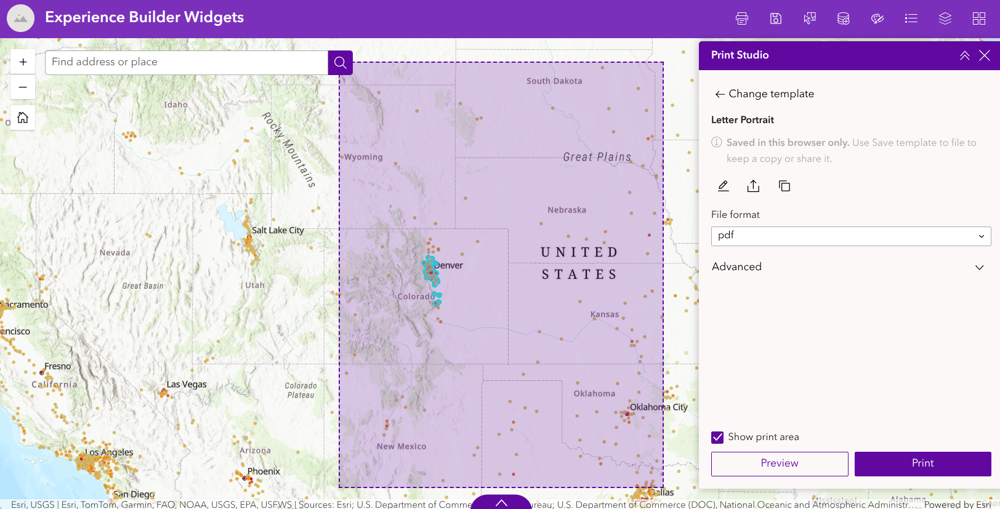
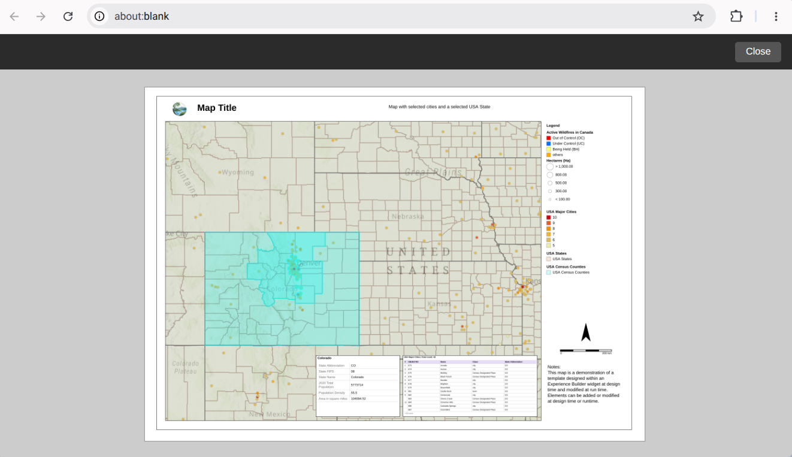
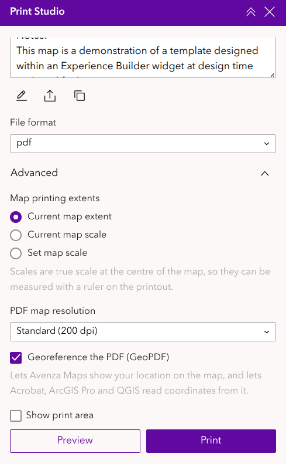
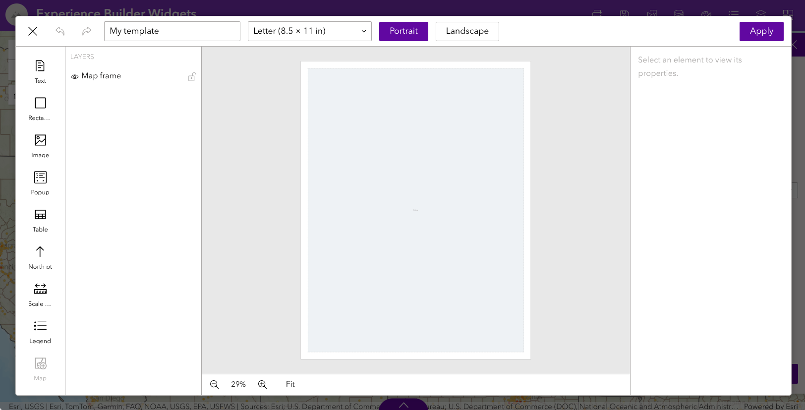
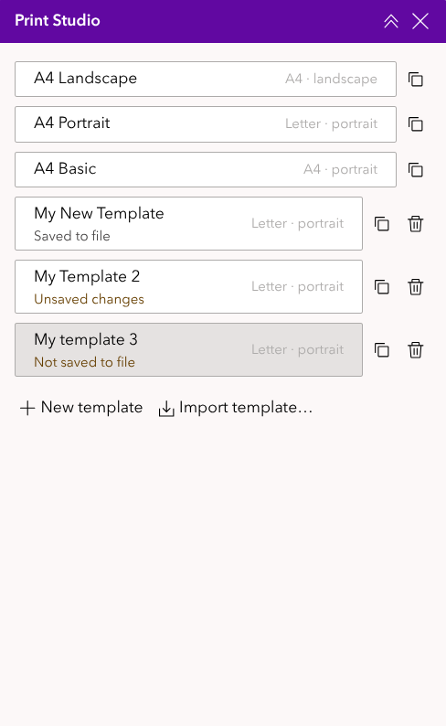
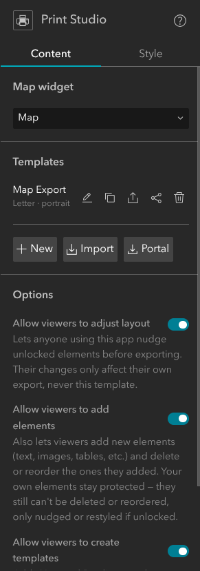
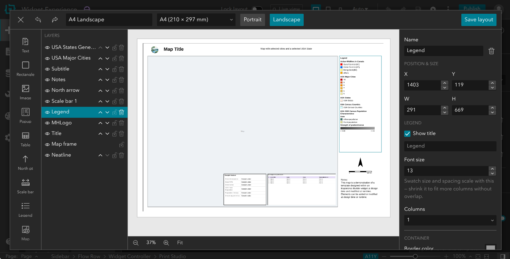

# Print Studio user guide

Print Studio prints the map in an ArcGIS Experience Builder app to a finished page: a title, the map, a legend, a scale bar, a north arrow, notes, tables and more, laid out on a Letter, Tabloid, A4 or A3 sheet. You can save the page as a PDF, a JPG or a PNG.

This guide has two parts:

- **[Printing a map](#printing-a-map)** is for anyone using an app that includes Print Studio.
- **[For app authors](#for-app-authors)** is for the person who builds the app and designs its print templates.

## Quick start

1. Open **Print Studio** from the app's toolbar or side panel.
2. Choose a **template**: the page layout you want.
3. Type a title (and any notes) into the boxes shown.
4. Pan and zoom the map to the area you want. Tick **Show print area** to see exactly what will be printed.
5. Leave **File format** on **pdf** and click **Print**. The file downloads to your computer.

## Printing a map

### Choosing a template

When Print Studio opens, it lists the templates available in this app. Each shows its page size and orientation, for example *A4 · landscape*. Click one to use it.

To switch to another template later, click **← Change template** at the top of the panel. (It only appears when there is more than one template.)

### Filling in the text

Some templates have text you can change before printing, such as the title or a notes box. Each one appears as a labelled box in the panel. Boxes grow to three lines as you type, then scroll.

Your text is used only for this print; it doesn't change the template.

### Showing the print area

Tick **Show print area** to outline and shade the part of the map that will be printed. The shaded box has the same shape as the map on the page, so what's inside it is what you get.

Pan and zoom the map until the area you want is inside the box.

### Choosing a file format

| Format | Best for |
|---|---|
| **pdf** (default) | Printing on paper, sharing and archiving. Text, lines, the legend and the scale bar stay sharp at any zoom, and the text can be searched and copied. Can also be georeferenced (see [GeoPDF](#georeferenced-pdf-geopdf)). |
| **jpg** | Emails, documents and presentations. A small image file of the whole page. |
| **png** | The same image as jpg, a little crisper, but a larger file. |

The jpg and png formats are images of the whole page at about 300 dpi.

### Previewing

Click **Preview** to open the page in a new browser tab and check it before printing. Close the tab with the **Close** button when you're done. To save the file, use **Print** in the panel.

If nothing happens when you click Preview, your browser may be blocking pop-ups for this site; allow them and try again.

### Printing

Click **Print**. The button shows **Printing…** while the page is made, and then your browser downloads the file, named after the template. Large pages at high resolution can take a few seconds.

If a message appears under the buttons after printing, see [Messages and troubleshooting](#messages-and-troubleshooting).

## Advanced options

Click **Advanced** to show more options. They work like the Advanced options in Experience Builder's standard Print widget.

### Map printing extents

These decide how much of the map is printed and at what scale.

- **Current map extent** (default): prints what's inside the print area, whatever the scale happens to be.
- **Current map scale**: prints at the scale the map is showing now. The scale is shown underneath, for example *1:22,576*. The print area changes size to show how much will fit on the page at that scale.
- **Set map scale**: prints at a scale you type, for example *24000* for 1:24,000. It starts with the map's current scale; the button beside the box resets it to that. You can't print until a scale is entered.

With a scale set, the print area can be larger than the map on your screen. A message tells you to zoom out if you want to see all of it; you don't have to, as it prints correctly either way.

**What "true scale" means:** Print Studio's scales are measured on the ground at the centre of the map. So on a 1:24,000 printout, 1 cm on paper really is 240 m on the ground, and you can measure distances with a ruler. (Some web maps, including many Esri basemaps, use a projection whose *stated* scale is only correct at the equator. Print Studio corrects for that, so its scale can differ from the scale shown elsewhere in the app.)

The map printing extents only apply to 2D maps. A 3D scene always prints its current view.

### PDF map resolution

For PDFs, you can choose the resolution of the map image:

- **Draft (150 dpi)**: the smallest files.
- **Standard (200 dpi)** (default): a good balance.
- **High (300 dpi)**: the sharpest basemap labels and lines, but larger files.

The rest of the page (text, legend, scale bar and so on) is always sharp, whatever you choose. This option only appears when the file format is pdf.

### Georeferenced PDF (GeoPDF)

When **Georeference the PDF (GeoPDF)** is ticked (the default), the PDF also records where the map is on the ground. Other apps can then use it as a map:

- **Avenza Maps** (phone or tablet): import the PDF and your location appears as a blue dot, even offline in the field.
- **Adobe Acrobat**: shows the coordinates of any point you hover over, using the geospatial location tool.
- **QGIS, ArcGIS Pro, GDAL**: add the PDF as a layer and it lands in the right place.

Only the map part of the page is georeferenced. Untick the option if you don't need it; it makes no visible difference to the printed page.

## Adjusting and creating templates

Depending on how the app is set up, you may also be able to change templates or create your own. If you don't see these buttons, the app's author has turned them off.

### Adjusting the layout before printing

If the **Edit Template** button (a pencil) appears under the text boxes, you can move and resize parts of the page before printing (and, if allowed, add your own elements such as extra text). Click **Apply** to use your changes.

Your changes only last until you close or reload the app, and they never change the app's own template. Elements the author has locked can't be moved.

### Creating your own templates

If the app allows it, the template list has **+ New template**, and each template has a **Duplicate** button (two overlapping squares):

- **New template** starts a blank page with a map on it.
- **Duplicate** copies a template, including any changes you've made to it, so you can keep them as your own.

Either way, the new template opens straight in the layout editor (see [The layout editor](#the-layout-editor)). Your own templates are fully yours: you can move, resize, add and delete anything, and change the page size and orientation.

### Saving your templates to a file

**Your own templates, and templates you import, are kept in this browser only.** They aren't saved to the app, so you'll lose them if you clear your browser data, and you won't see them on another computer or browser.

To keep a copy, or to share a template with someone else, select it and click **Save template to file** (the arrow pointing up out of a tray, under the text boxes). This downloads a small `.json` file. Use **Import template…** at the bottom of the template list to load it again, on any computer.

The template list reminds you which templates need saving:

| Tag | Meaning |
|---|---|
| *Not saved to file* | Created in this browser and never saved. |
| *Unsaved changes* | Saved to file before, but changed since. |
| *Saved to file* | Matches the last file you saved. |

A note in the panel gives the same reminder while a template has something unsaved.

To remove one of your own or an imported template, click its bin (delete) button, then **Confirm delete?** to be sure. The app's own templates can't be deleted.

## For app authors

This part explains how to add Print Studio to an app and design its templates in Experience Builder (Developer Edition).

### Adding Print Studio to an app

1. In the builder, drag **Print Studio** from the widget panel into your app, for example into a widget controller or a sidebar.
2. In its settings, under **Map widget**, choose the map it should print.
3. Add or import at least one template (see below), then save the app.

### Managing templates

The **Templates** section lists the app's templates, with buttons to:

- **New**: create a template (a blank Letter page with a map frame) and open it in the layout editor.
- **Edit**: open a template in the layout editor.
- **Duplicate**: copy a template.
- **Export to file** / **Import**: save a template as a `.json` file, or load one, for example to reuse a template in another app.
- **Save to Portal** / **Portal** (load from Portal): store templates as items in your ArcGIS Online or Enterprise content, so they can be shared between apps and colleagues. After the first save, the button becomes **Update on Portal**.
- **Delete**: click once, then **Confirm delete?**.

Templates are saved with the app, so remember to save the app after changing them.

### The layout editor

The layout editor is where you design a page. It's the same editor viewers use for their own templates.

- **Top bar:** close, undo and redo (**Ctrl+Z** and **Ctrl+Y**), the template's name, the page size (Letter, Tabloid, A4 or A3), **Portrait** or **Landscape**, and **Save layout**.
- **Tools (left):** click a tool, then click the page to place the element at its default size, or drag to draw it at the size you want. Press **Esc** to cancel.
- **Layers:** every element on the page, front-most first. Use the eye to hide or show an element, the arrows to move it forward or back, the padlock to lock it, and the bin to delete it (select the element first).
- **Page (centre):** drag elements to move them, and drag their edges to resize. While you drag, elements snap to the edges and centres of other elements and of the page, with a guide line showing the alignment. Zoom with the buttons underneath, or click **Fit**.
- **Properties (right):** settings for the selected element: its name, exact position and size, border, corner radius and background fill, plus the settings for its type (below).

Click **Save layout** to keep your changes, then save the app.

#### Elements

| Element | What it shows | Main settings |
|---|---|---|
| **Map** | The map, as captured when printing. Every template has exactly one, and it can't be deleted. | Position, size, border, corner radius. |
| **Text** | Titles, subtitles, notes. | Content, font (Arial, Times New Roman, Courier New), size, weight, colour, alignment. Tick **Editable at runtime** to let viewers change the text before printing; the element's name becomes the label of its box in the panel. |
| **Rectangle** | Boxes and neatlines. | Border, corner radius, fill. **Arrange** moves it to the front or back. |
| **Image** | Logos and pictures. | **Upload** a PNG or SVG (up to 1 MB), or choose an image from **Portal**. **Lock aspect ratio**. |
| **North pt** | A north arrow. | Style (classic, compass, minimal, compass rose), colour, **Sync to map rotation** or a fixed rotation. |
| **Scale bar** | A scale bar measured from the printed map. | Units (km, m, mi, ft), style (line or alternating bar), alignment, font size. |
| **Legend** | The symbols of the layers currently visible on the map, as the standard Legend widget shows them. | **Show title**, font size (which also scales the swatches), and **Columns**. Layers are placed side by side in columns, kept whole where they fit; a layer too long for the box continues at the top of the next column. **Auto** uses the fewest columns that fit. |
| **Table** | The selected features of a layer, one row each. | Layer, fields and column headers, title, row numbers, colours. |
| **Popup** | The first selected feature of a layer, as a card of field labels and values. | Layer, fields and labels, title (can include `{field}` values), colours. |

Tables and popups show the features selected in the app **when the page is printed**, for example with a Select tool or by clicking the map. In the editor they show sample values.

**Locking:** a locked element can't be moved by viewers who are allowed to adjust layouts. You can still move it yourself in the editor. The map frame of a new template starts locked.

### Viewer options

Under **Options**, choose what people using the app may do:

- **Allow viewers to adjust layout**: viewers can move and restyle unlocked elements before printing. Their changes never alter your templates.
- **Allow viewers to add elements**: they can also add their own elements (text, images, tables and so on) and delete or reorder the ones they added. Needs the option above.
- **Allow viewers to create templates**: adds **New template** and **Duplicate** to the template list, so viewers can make their own templates, kept in their browser (see [Creating your own templates](#creating-your-own-templates)).

All three are off by default.

## Messages and troubleshooting

| You see | What it means / what to do |
|---|---|
| Nothing happens when you click **Preview** | The browser blocked the pop-up. Allow pop-ups for this site. |
| *Enter a map scale in Advanced to print.* | **Set map scale** is selected but no scale has been entered. Type one in **Advanced**, or choose another option. |
| *At this scale the print area is larger than the map.* | The printed area goes beyond your screen. Zoom out to see it all, or print anyway. |
| *The map was printed at … dpi instead of … dpi…* | The page was too large for your browser to capture at the resolution asked for, so it used the highest it could. Choose a lower PDF map resolution or a smaller page to avoid it. |
| *The map could not be drawn at 1:…, so it was printed at 1:…* | The map couldn't show the scale asked for, usually because it's more detailed than the basemap allows. |
| *Print scales apply to 2D maps only…* | The map is a 3D scene, which always prints its current view. |
| *The PDF was saved without georeferencing…* | The map's coordinates couldn't be read (for example, a 3D scene). The PDF is otherwise fine. |
| A table or popup on the page is empty | Nothing was selected in its layer. Select features on the map first. |
| My own template has gone | It was kept in the browser, and the browser data was cleared, or you're on another browser or computer. Import it from the saved file. |
| Some accented text in a PDF can't be selected | Characters outside the Western European set (for example the macron in *Whangārei*) are drawn as a sharp image so they print correctly; that text can't be selected or searched. |
